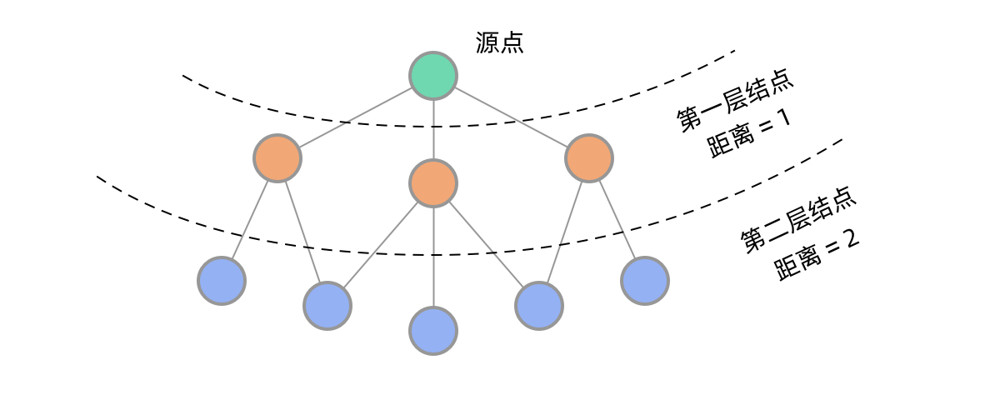

# BFS模版

`Queue<Integer> queue = new LinkedList<>();  
满足条件A的加入queue；  
  
  
while (!queue.isEmpty()) {   
    int i = queue.poll();  
    ...  
    对i一番操作后；  
    把满足条件A的加入queue；  
}`

### 应用1：tree的层序遍历

### 应用2：最短路径

[https://leetcode.com/problems/as-far-from-land-as-possible/](https://leetcode.com/problems/as-far-from-land-as-possible/)

[https://leetcode-cn.com/problems/binary-tree-level-order-traversal/solution/bfs-de-shi-yong-chang-jing-zong-jie-ceng-xu-bian-l/](https://leetcode-cn.com/problems/binary-tree-level-order-traversal/solution/bfs-de-shi-yong-chang-jing-zong-jie-ceng-xu-bian-l/)

