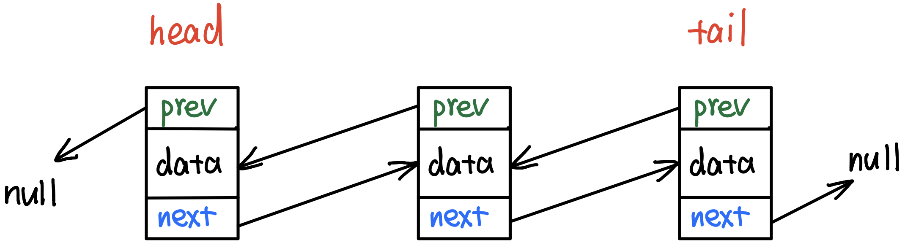

# \[数据结构\] Doubly LinkedList

## Doubly LinkedList 双向链表概念：

每一个节点包含data, next, prev；其中data存放数据，**`next`存放下一个节点的引用Reference，`prev`存放上一个节点的引用Reference**。  
head指向头节点，tail指向尾节点。head的`prev`指向null，tail的`next`指向null。




**优点：**  
1. Doubly LinkedList可以实现双向遍历，而Singly LinkedList只能单向遍历；  
2. 插入和删除操作简便快捷，耗时仅为O\(1\)；

**缺点：**  
由于多了一个prev指针，所以更耗费空间。


## ★Doubly LinkedList的内部构造方法：`背下来！！！`

用一个ListNode类来充当结点的模型。  
其中有3个属性：存放数据的val，存放下一个结点的引用Reference，存放上一个结点的引用Reference；

```text
public class ListNode {
			int val;
			ListNode next;
			ListNode prev;
			

			ListNode() {}

			ListNode(int val) {
				this.val = val;
			}

			ListNode(int val, ListNode next, ListNode prev) {
				this.val = val;
				this.next = next;
				this.prev = prev;
			}
}
```


