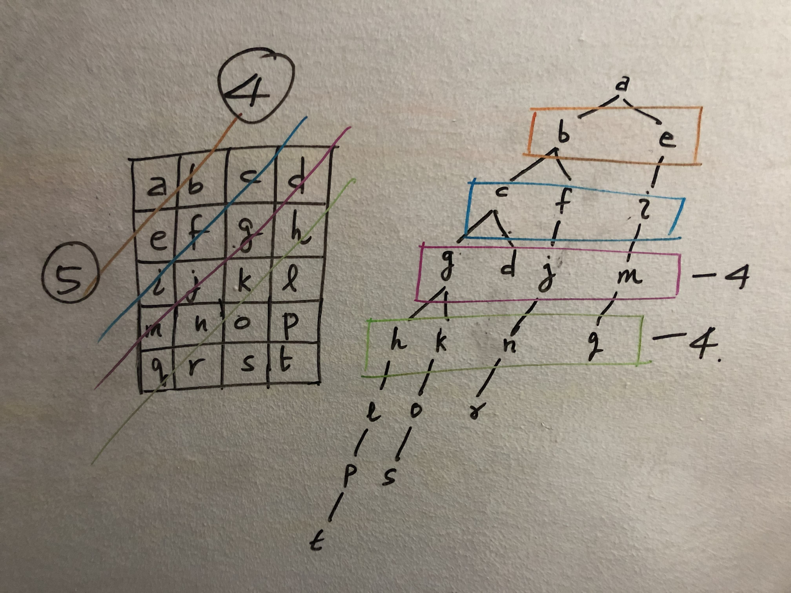

# 空间复杂度 Space complexity

●如果用HashMap或者StringBuilder新建一个长度为n的东西，空间复杂度为`O(n)`；

●如果新建一个长度为n的数组，空间复杂度为`O(n)`；

●`Arrays.sort(Object[])`：O\(logn\)；

●DFS：  
空间复杂度为DFS的层数，也就是树的高度。

### ●BFS： **空间复杂度就是BFS的queue能产生的最大长度。**

#### 情况1：

假设有n个node，构成一个图，进行BFS，那么worst case就是所有的node构成一条直线图；此时空间复杂度就是能够reach到图的最深处的那条路径的长度。  
在backtrack的时候，我们需要用一个`visited[]`的数组来记录已经访问过的node，这个数组的长度就为n，所以空间为`O(n)`；

#### 情况2：

如果对一个长宽为M、N的二位数组`grid[][]`进行BFS，空间是`O(min(M, N))`，解释：

**Space复杂度就是BFS的queue里的最大长度** ⇒ 也就是矩阵中能产生的Maximum siblings   
 ⇒ 也就是矩阵`grid[][]`中能够画出的**最大的正方形的对角线长度**（比照图中粉色和绿色的长度）  
 ⇒ 也就是长方形矩阵M、N中的最小值；  
 ⇒ 所以是`O(min(M, N))`

●Union find：

### ●Tree：

对于tree，如果是BFS，空间一般是`O(n)`，也就是node的个数；

如果是DFS，空间一般是`O(h)`，h是树的高度，也就是recursion的层数；

