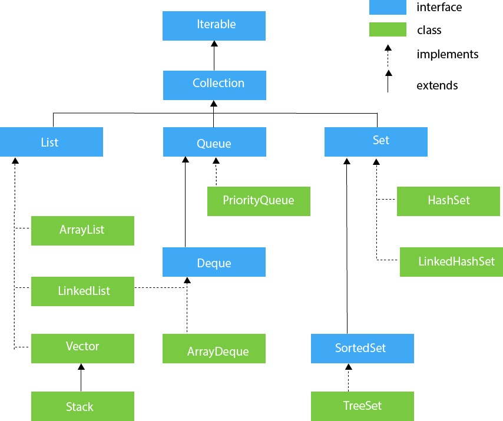

# \[数据结构\] ArrayList

核心：是**长度可变**的数组；与传统built-in array的区别：是否**resizable；**

**初始化：**  
一维：`List<Integer>() res = new ArrayList<>();`

二维：`List<List<Character>>() res = new ArrayList<>();` 一维二维等号后面都一样


## **核心的Syntax:**

●`res.add(“ ”)`：往list里面加元素加String需要引号””，加数字的话不需要; 

●`res.get(index i)`：返回list中第i个元素;

●`res.remove(index i)`：移除指定位置的元素;

●`res.size()`：返回元素的个数;


### 怎样sort一个ArrayList？

★ `Collections.sort(list);`


### **ArrayList 怎样转化为➔ Array:**

方法1：使用**`res.toArray();`    \(**方法2：遍历法；一个个get\(\)，依次加到array\)

例1：`Object[] nums = ArrList.toArray();`

例2：`Integer arr[] = new Integer[ArrList.size()];   
arr = ArrList.toArray(arr);`


### **Array 怎样转化为➔ ArrayList:**

方法1：使用**`Arrays.asList(res);`    \(**方法2：遍历法；把nums\[i\]一个个add\(\)进list\)

例：`List<String> res = Arrays.asList(array);`

方法3：使用**`Collections.addAll();`**     使用前一定要先create一个新的list；

例：`String[] nums  = {"a", "b", "c", "d", "e"};  
List<String> list = new ArrayList<String>();   
Collections.addAll(list, nums);`


### ⚠️  注意：

在List赋值时，如果如果使用`new ArrayList<>(list)`后面括号内容来赋值的话，括号内的list不能为空，否则会报NullPointerException的错：

```text
//方式1：（可行）✅
		List<Integer> list1 = null;
		List<Integer> list2 = list1;

//方式2：（不可行）❌
		List<Integer> list1 = null;
		List<Integer> list2 = new ArrayList<>(list1);
```

## **LinkedList和ArrayList的区别：** 

1. 它们之间最主要的区别在于ArrayList是可改变大小的数组，而LinkedList是Doubly LinkedList；
2. **ArrayList查找快，增删慢**。ArrayList获取数据get\(\)的时间复杂度是O\(1\)，但是，要add插入或者remove删除数据时间却是O\(n\)，因为这需要重新排列数组中的所有数据；
3. **LinkedList增删快**，但耗内存。LinkedList中插入或删除的时间复杂度仅为O\(1\)，但是，LinkedList需要更多的内存，因为ArrayList的每个索引的位置是实际的数据，而LinkedList中的每个节点中存储的是实际的数据和前后节点的位置。


其他Syntax:

●`Collections.sort(res)`：给list排序  
●`Collections.reverse(res)`：将list翻转/倒序。注意：reverse只能反转一个list不能用于array，如果想要用于array就要使用Arrays.asList\(\)方法。  
●`res.add(index i, 元素)`：把指定的元素加入到指定的位置i上去，如果i上已经有元素了，那么i本身和i之后的所以元素都向后顺移一位，list的size增大一;  
●`res.set(index i, 元素)`：把list里第i个元素**替换/跟新**成新的指定元素;  
●`res.isEmpty()`  
●`res.indexOf()`  
●`res.contains(“ ”)`  
●`res.clear()`：清除list里所有元素  
●`Collections.nCopies(int n,  Object)`：在长为n的list中，使object复制出现n次；


关系图：




extends 是继承某个类，继承之后可以使用父类的方法，也可以重写父类的方法；  
implements 是实现多个接口，接口的方法一般为空的，必须重写才能使用。

Difference:   
**Implements** means you are using the elements of a Java Interface in your class.   
**Extends** means that you are creating a subclass of the base class you are extending. You can only extend one class in your child class, but you can implement as many interfaces as you would like.


