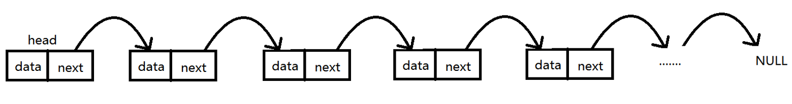
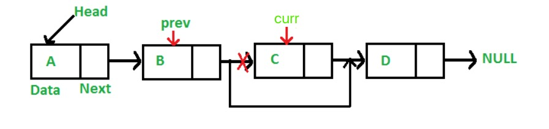

# \[数据结构\] LinkedList

## Singly LinkedList概念：




  
每一个节点包含data和next；**data存放数据，next存放下个节点的引用Reference**。  
head指向头节点，head不存放任何的数据，只是充当一个指向链表中真正存放数据的第一个节点的作用。  
就这样一节一节往下面记录，直到最后一个节点的next指向null。

**初始化：**`List<String> list = new LinkedList<>();`


## ★Singly LinkedList的内部构造方法：`背下来！！！`

用一个ListNode类来充当结点的模型。  
其中有两个属性：存放数据的data，和存放下一结点的引用Reference；

```text
public class ListNode {         
     int data;                    //存放数据的变量，为了简单一般为int型；
     ListNode next;            //存放结点的变量,默认为null
     ListNode(int num) {       
         data = num;           //构造方法，在构造时就能够给data赋值
         next = null;
     }   
}

```

详细版本：[https://github.com/bhnigw/algorithms/blob/master/src/Medium/LinkedList.java](https://github.com/bhnigw/algorithms/blob/master/src/Medium/LinkedList.java)


## 检查LinkedList有没有cycle/loop

方法一：如果不考虑空间复杂度，可以使用一个HashSet记录走过的节点，当遇到第一个在HashSet中存在的节点时，就说明回到了出发点，即链表有环，同时也找到了环的入口。（即便节点的val值有duplicate也不影响，对于HashSet来说不算重复，因为加入的是不同的对象本身，和val没有关系）

★方法二：**Two pointer，**空间是O\(1\)；使用快慢指针，即采用两个指针fast和slow，slow每次移动一步而fast每次移动两步。当fast和slow第一次相遇时，证明链表有环。

详细：[https://bhnigw.gitbook.io/leetcode/](https://bhnigw.gitbook.io/leetcode/)


## 如何遍历Singly LinkedList：

```text
public static void printList(LinkedList list) {
		Node currNode = list.head;

		while (currNode != null) {
			System.out.print(currNode.data + " ");
			currNode = currNode.next;
		}
	}
```


## 计算单链表的长度：

```text
public int length(Node head) {
		int length = 0;
		Node currNode = head;
		
		while (currNode != null) {
			length++;
			currNode = currNode.next; //注意一般都是先操作，再next
		}
		
		return length;
	}
```


## 删除某个值为val的结点：



核心：`prev.next = curr.next;`

```text
public void deleteNode(int val) {
		Node curr = head;
		Node prev = head;

		// 假如第一个就是要删除的,直接next
		if (curr.data == val) {
			head = curr.next;
			return;
		}

		// 遍历list，跳过那些值不为val的节点
		while (curr != null && curr.data != val) {
			prev = curr;
			curr = curr.next;
		}
		
		// 没有找到要删除的，return
		if (curr.next == null) return;

		// 如果找到了，就删除
		prev.next = curr.next;
	}
```

## 基础必会：如何reverse一个LinkedList

[https://bhnigw.gitbook.io/leetcode/ji-chu-bi-hui/leetcode-206.-reverse-linked-list](https://bhnigw.gitbook.io/leetcode/ji-chu-bi-hui/leetcode-206.-reverse-linked-list)

Follow up: 

-What are the cases you would test?   
Ans:   
1. Empty list;  
2. List that has cycle/loop;  
3. List that spreads to two or multiple branches;  
4. List is huge, too long;  


-If this was an internal API what could break?  
Ans: has cycle/loop;


## 要考虑的Test Case：

一般来说，有关linked list的题都可以用以下的test case：

1. Empty list;
2. List that has cycle/loop;
3. List that spreads to two or multiple branches;
4. List is huge, too long;


## **一些Syntax:**

●`list.add()`： 添加元素  
●`list.get(index)`：取值  
●`list.remove(element)`： 删去元素，如果有duplicate就删除第一个出现的

●`list.addFirst()`： 加在最前  
●`list.addLast()`： 加在最末  
●`list.removeFirst()`： 去除最前  
●`list.removeLast()`： 去除最末  
●`list.getFirst()`： 取值最前  
●`list.getLast()`： 取值最末

