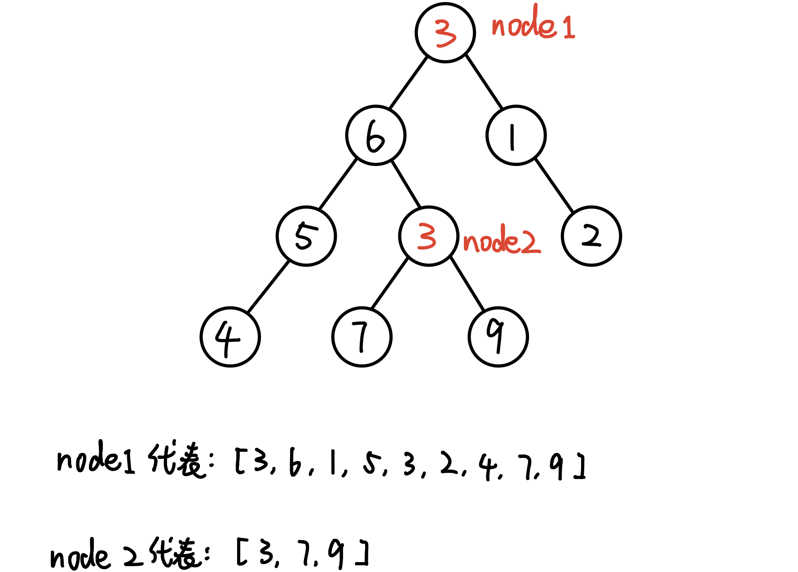

# \[数据结构\] HashMap

**核心：**HashMap的底层数据结构是 is array of LinkedList，用来存key-value pair；

**初始化：**

`HashMap<Character, Character> map = new HashMap<>();`

`HashMap<String, Integer> map = new HashMap<>();`

\*\*\*\*

**注意：**   
1. HashMap不允许有重复的key，可以有重复的value   
2. key中允许**至多**有一个null值，value中可以有多个null值   
3. HashMap是无序的


### **核心的Syntax：** 

★`map.put(key, value)`: 写入，把value加入进去，对应某个key 

★`map.get(key)`: 取值，取出key所对应的那个value。如果是`map.get(null)`不会报错，会返回null。

★`map.getOrDefault(key, 初始value)`: 如果map里有这个key那就返回它对应的value，如果没有这个key则给它一个初始的value对应这个key

●`map.containsKey(key)`：如果map里含有这个key，就返回true 


其他Syntax：

●`map.remove(key)`：移除这个key，且和它对应的value

●`map.keySet()`：返回map里所有的keys，放在一个**set**里

●`map.values()`: 返回map里所有的values

●`map.size()`：返回map的size，也就是有多少个key-value pair

`map.containsValue(value)`：也是一个boolean 值，map里有这个value就返回true 

`map.isEmpty()`：如果map为空就returns true 

`map.clear()`：把这个map清空，不返回任何值

`map.entrySet()`：返回一个装有map里所有元素的set 

## 

使用实例：

```text
    HashMap<Integer, String> map = new HashMap<>();
		
		map.put(1, "aaa");
		map.put(2, "bbb");
		map.put(3, "ccc");
		map.put(4, "ddd");

		System.out.println(map);            //打印这个HashMap
		
		System.out.println(map.entrySet()); //打印一个装有HashMap所有元素的set 
		
		System.out.println(map.keySet());   //打印所有key
		
		System.out.println(map.values());   //打印所有value
```

print输出：

`{1=aaa, 2=bbb, 3=ccc, 4=ddd}`

`[1=aaa, 2=bbb, 3=ccc, 4=ddd]`

`[1, 2, 3, 4]`

`[aaa, bbb, ccc, ddd]`

    

## **★怎样loop遍历HashMap：**

1. 遍历keys：使用`map.keySet()`

```text
for (String str : map.keySet()) {
			System.out.println(str);
		}
```

2. 遍历values：使用`map.values()`

```text
for (String str : map.values()) {
			System.out.println(str);
		}
```


## 如果把TreeNode加入HashMap：

如果一个tree中有两个node的值相同，把它们作为key加入map会出现重复吗❓

答案：不会。因为map存的是TreeNode，只是那个object的指针，根root.val没有关系。可以理解为一棵树上不存在完全一样的TreeNode。



所以，  
`map.put(node, node.val)`不会重复，是可行的；  
`map.put(node.val, node)`会出现重复，不可行。


## **HashMap与HashTable的区别：**

| **HashMap** | **HashTabel** |
| :--- | :--- |
| 线程不安全 | 线程安全 |
| Non-Synchronized | Synchronized |
| 允许有null的key和value | 不允许有null的key和value |
| HashMap是HashTable的轻量级实现 | HashTable 比HashMap要旧     |
| 高效 | 低效 |


一般来说，HashMap优于HashTable。


**什么是Hashing：**  
就是把一个object转化为一个整数值的过程。  
It is the process of **converting an object into an integer value**. The integer value helps in indexing and faster searches.


**HashMap的底层实现：\(Internal Process of HashMap\)**

It uses an array and **LinkedList** data structure internally to store Key and Value.


**How does put\(\) method work?** 

Because the data structure of HashMap is array of LinkedList. The LinkedList is the list of HashEntry.   
When we use the put \(\) method. It will get call hashCode\(\) to get the hashCode of the object. This hashcode will as the index to find the location of the array. If this location is empty, then this element will be added into this location and as the first node of the LinkedList. However, if this location is not empty, then it will traverse the LinkedList and use equals \(\) to compare. If the LinkedList contain the same element, then the element will not be added otherwise the element will be added into this list. Notice: If two object equals \(\) method return true then they must have the same hashcode. On the contract, if two object has same hashcode, they might not return true in euqals\(\) method


