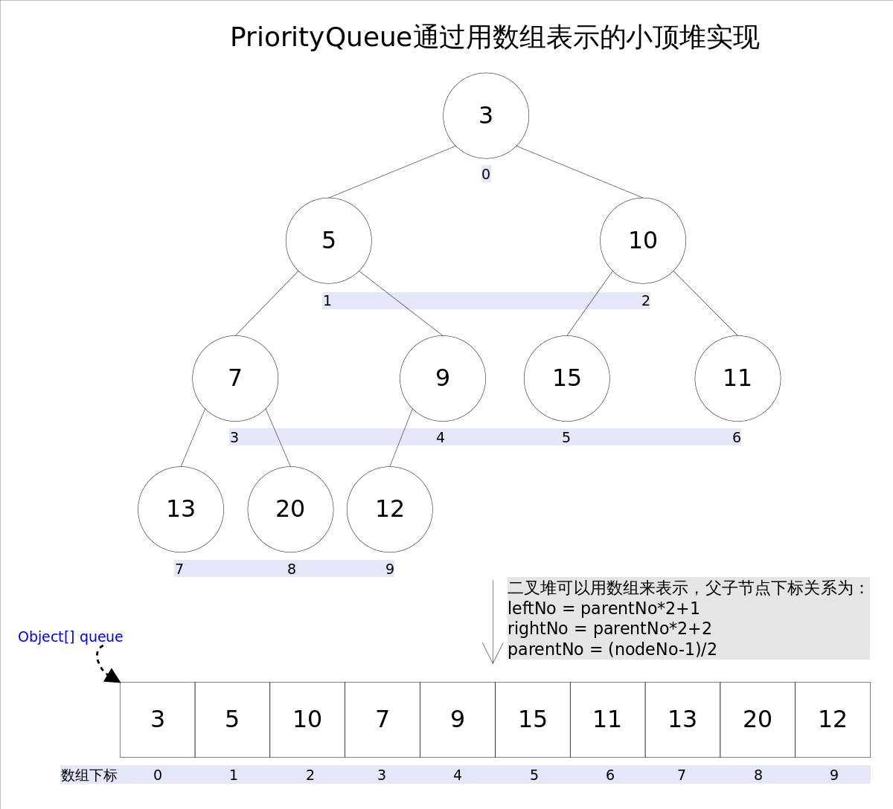

# \[数据结构\] PriorityQueue

底层数据结构：Binary tree。按给定的优先级排列。

**初始化：**`PriorityQueue<String> pq = new PriorityQueue<>();`

### **核心的Syntax:**

★`pq.offer(element)`： 插入元素。时间`O(logn)`；

★`pq.poll()`：**取出并返回**PriorityQueue的第一个元素（二叉树的头节点）。时间`O(logn)`；

●`pq.peek()`：返回PriorityQueue的第一个元素（二叉树的头节点），但是**不取出**。时间`O(1)`；

●`pq.remove(element)`：删去等于element的元素，如果有多个相等，只删除一个。时间：`O(n)`；

 

