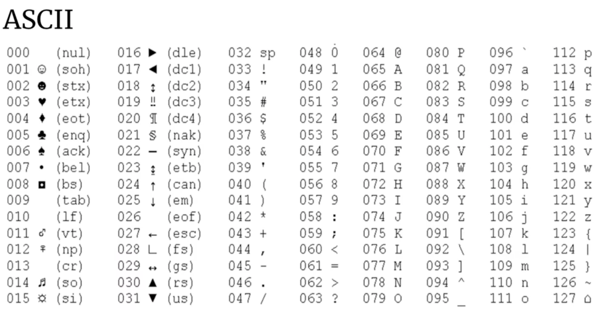

# ASCII码




对于一些关于char array的题，


```text
    int[] nums = new int[128];
    nums['9']++;

    for (int i = 0; i < 128; i++) {
        if (nums[i] == 1) {
            System.out.println(i); //这里会输出57
        }
    }
```

### \*\*\*\*

