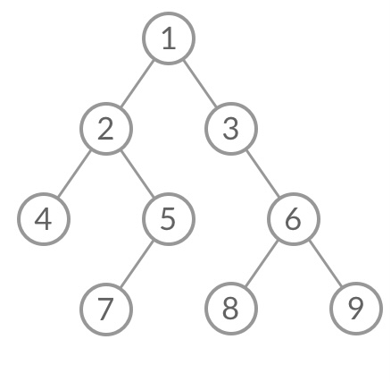
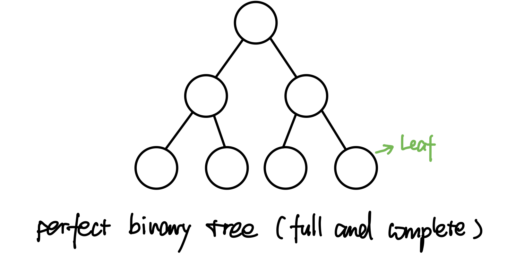
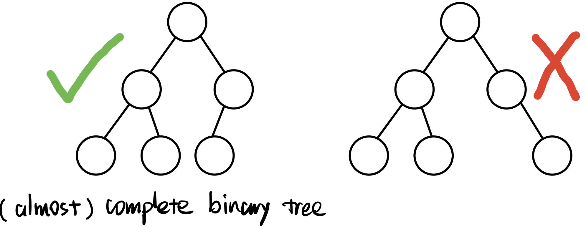
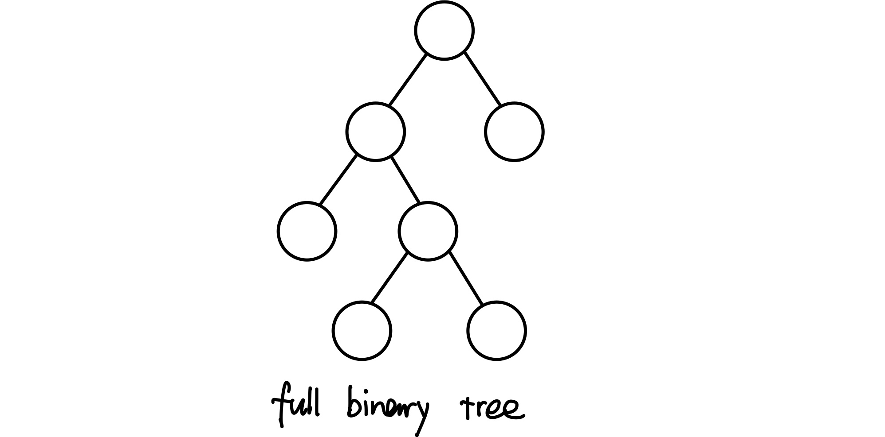

# \[数据结构\] Tree

## Tree的概念和性质

树是一种无向图（undirected graph），其中任意两个顶点间存在唯一一条路径。


**一个graph能称作是一个tree，那么它必须满足以下条件/具有以下特点：**

1. 任何两个节点之间都有一条连接的路径；也就是说，所有点都必须fully connected，不能有落单的；
2. 图中不能有环cycle/loop；
3. ★**如果一个tree有n个节点，那么它必然有n - 1条edges**； 若少于`n - 1`则必然有点没有连接上， 若多于`n - 1`则必然有环cycle/loop；



## Binary Trees

**二叉树Binary trees**：每个节点至多含有两个子树的树称为二叉树；

### ★**Binary tree二叉树**的构造方法：背下来❗️❗️❗️

```text
public class TreeNode {
	int val;
	TreeNode left;
	TreeNode right;

	TreeNode() {}  //注意这里是什么意思

	TreeNode(int val) {
		this.val = val;
	}

	TreeNode(int val, TreeNode left, TreeNode right) {
		this.val = val;
		this.left = left;
		this.right = right;
	}
}

```

第6行的操作是什么意思？  
意思是：可以进行没有参数的初始化。没有这句的话，初始化就必须`TreeNode t = new TreeNode(3)`；有了这句就可以`TreeNode t = new TreeNode()`；  
例：  
`TreeNode empty = new TreeNode();` 第6行的功能  
`TreeNode left = new TreeNode(1);` 第8行的功能  
`TreeNode right = new TreeNode(2);`  
`TreeNode root = new TreeNode(3, node1, node2);` 第12行的功能；意思是把root的val设为3，把node1作为根节点root的左child，把node2作为根节点root的右child。

## Binary Search Trees（BST）

Binary Search Tree的定义如下：（一句话概括是「左小右大」）

对于树上任意节点node：  
1. node 的左子树**「所有」**结点一定小于 node 值；  
2. node 的右子树**「所有」**结点一定大于 node 值；  
3. node 的左、右子树均为Binary Search Tree；

Binary Search Tree的优势在于**时间复杂度较低**，search、insert、delete的时间复杂度等于树的高度也就是`O(logn)`，最坏的情况是`O(n)`。（worst case是数列已经sorted，树退化成高度为n的一条线）

[BST的Insert算法](https://bhnigw.gitbook.io/leetcode/leetcode/binary-search-tree/cha-ru-insert)

[★BST的Delete算法](https://bhnigw.gitbook.io/leetcode/leetcode/binary-search-tree/shan-chu-delete)

[BST的Search算法](https://bhnigw.gitbook.io/leetcode/leetcode/binary-search-tree/cha-zhao-search)


## 树的遍历

[前序 Pre-order](https://bhnigw.gitbook.io/-1/shu-ju-jie-gou-tree/qian-xu-bian-li-preorder-traversal)：根→左→右（Top down）

[中序 In-order](https://bhnigw.gitbook.io/-1/shu-ju-jie-gou-tree/zhong-xu-bian-li-inorder-traversal)：左→根→右

[后序 Post-order](https://bhnigw.gitbook.io/-1/shu-ju-jie-gou-tree/hou-xu-bian-li-postorder-traversal)：左→右→根 （**Bottom up**）

[层序 Level Order](https://bhnigw.gitbook.io/leetcode/leetcode/leetcode-102.-binary-tree-level-order-traversal)：每一层从左到右遍历；



前序遍历：1 2 4 5 7 3 6 8 9

中序遍历：4 2 7 5 1 3 8 6 9

后序遍历：4 7 5 2 8 9 6 3 1

层序遍历：1 2 3 4 5 6 7 8 9


## Perfect Binary Tree & Almost Complete Tree & Full Binary Tree

● `Leaf 叶子节点`：Leaf is a node that has no children；也就是终端结点。

● **`Perfect Binary Tree 完美二叉树`**：所有非Leaf结点都有两个child，且所有的Leaf都在同一水平线。



对于Perfect Binary Tree完美二叉树，它的Leaf节点有 **`n / 2`**个。


● **`Complete Tree 完全二叉树`**：从root至倒数第二层，满足Perfect Binary Tree，最后一层的Leaf可以不完全填充，但是Leaf必须靠左对齐。




● **`Full Binary Tree 完满二叉树`**：所有非Leaf结点都有两个child，Leaf不必在同一层。（只要你有child，就必然是有两个child）




## 在BFS或DFS时，怎样确定结点来自tree的哪一层？

●如果是BFS：需要在每一层while循环开始时，记录当前queue的长度n，也就是每一层的size，然后在while里用for循环`(int i = 0; i < size; i++)`把这一层的node都poll光；

●如果是DFS：需要在每次recursion的时候，都带一个整数level进去，表示当前的层数；每进入下一层，层数level就加1；

[点击看详细解析](https://bhnigw.gitbook.io/leetcode/leetcode/leetcode-102.-binary-tree-level-order-traversal)


## 经典必会例题：

[863. All Nodes Distance K in Binary Tree](https://bhnigw.gitbook.io/leetcode/leetcode/leetcode-863.-all-nodes-distance-k-in-binary-tree)


