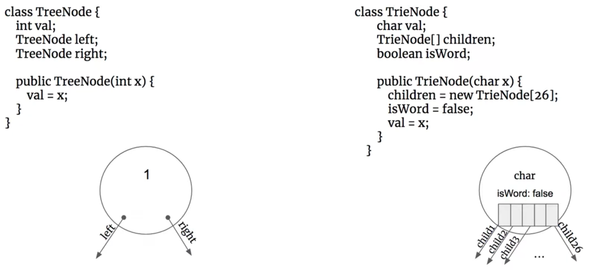

# \[数据结构\] Trie - Prefix Tree

概念：Trie，也叫做Prefix Tree，中文是前缀树。核心思想是空间换时间，利用字符串的公共前缀prefix来减少无谓的字符串比较，以达到提高查询效率的目的。

除root外，每一个node都包含两个值，一个是字符char，一个是boolean值isWord；  
每个node可以有多个child node，最多可以有26个child，也就是英文字母表的size。


下面构建一个含有关键词`and, as, at, cn, com`的Trie树：


### 由图可以看出，Trie tree有以下特性：

1. **根节点root不包含字符**，除根结点root外的每一个子节点都包含一个字符；
2. 从root到任意一个最底层的节点，路径上经过的字符连接起来，就对应集合里的一个关键词；
3. 每个单词的公共前缀作为一个字符节点保存；
4. 每个节点可以有多个child node，最多可以有26个child，也就是英文字母表的size；


## Trie的主要的三个作用：

#### 1. 字符串的查询和检索：

Search功能是Trie树最原始的功能。思路就是从根节点root开始一个一个字符char进行比较：   
• 如果沿路比较，发现不同的字符，则表示该字符串在集合中不存在；  
• 如果所有的字符全部比较完并且全部相同，还需判断最后一个节点的isWord这个boolean值是否为true，如果为true，则说明该节点代表一个关键词；如果false则代表该字符串不属于集合中的关键词；

####  2. 前缀匹配：

比如找出一个字符串集合中所有以ab开头的字符串。我们只需要用所有字符串构造一个trie树，然后输出以a-&gt;b-&gt;开头的路径上的关键字即可。trie树前缀匹配常用于搜索提示。如当输入一个网址，可以自动搜索出可能的选择。当没有完全匹配的搜索结果，可以返回前缀最相似的可能。

#### 3. 词频统计

#### 4. 自动补全 autocomplete


#### 5. 拼写检查 spellcheck

\*\*\*\*

\*\*\*\*

## Binary Tree与Trie的比较：


| Binary Tree | Trie \(Prefix Tree\) |
| :--- | :--- |
| 每个node带有一个value，是int                                                                  | 每个node带有**两个**value，一个是字符char，一个是boolean值isWord |
| 每一个node有两个child，分别是left和right | 每一个node可以拥有多个child，最多26个 |
| 二叉树的root有value | Trie的root是null没有任何值，只相当于一个head |




怎样构造一个Trie：

```text
class TrieNode { //三行内容分别是：一个char值，一个boolean值，和26个child
    char val;
    boolean isWord; 
    TrieNode[] children = new TrieNode[26];
    
    public TrieNode() { }
    
    TrieNode(char c){
        TrieNode node = new TrieNode();
        node.val = c;
    }
}
```


#### 关于Trie的空间复杂度：

一般来说是O\(n\)，n代表Trie tree有多少个一共node；有多少node就占了多少空间；


例题：  
[208.Implement Trie \(Prefix Tree\)](https://bhnigw.gitbook.io/leetcode/leetcode-208.-implement-trie-prefix-tree)


